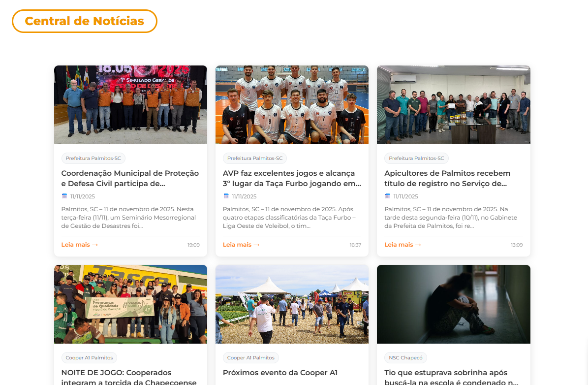
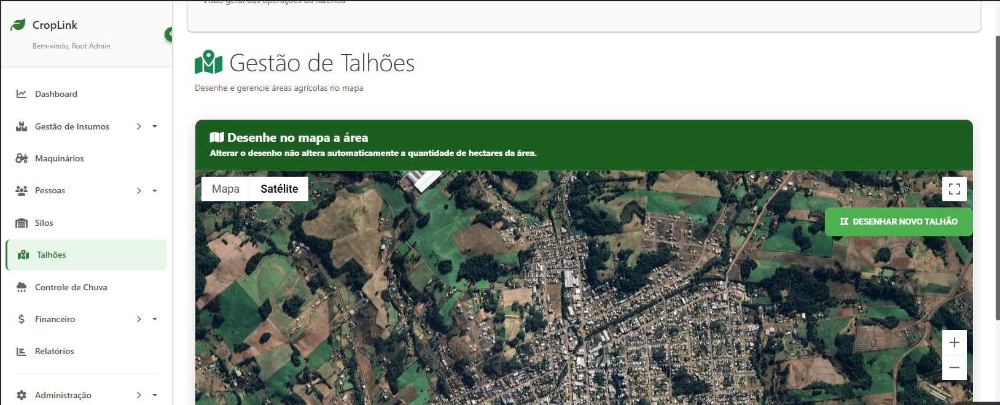
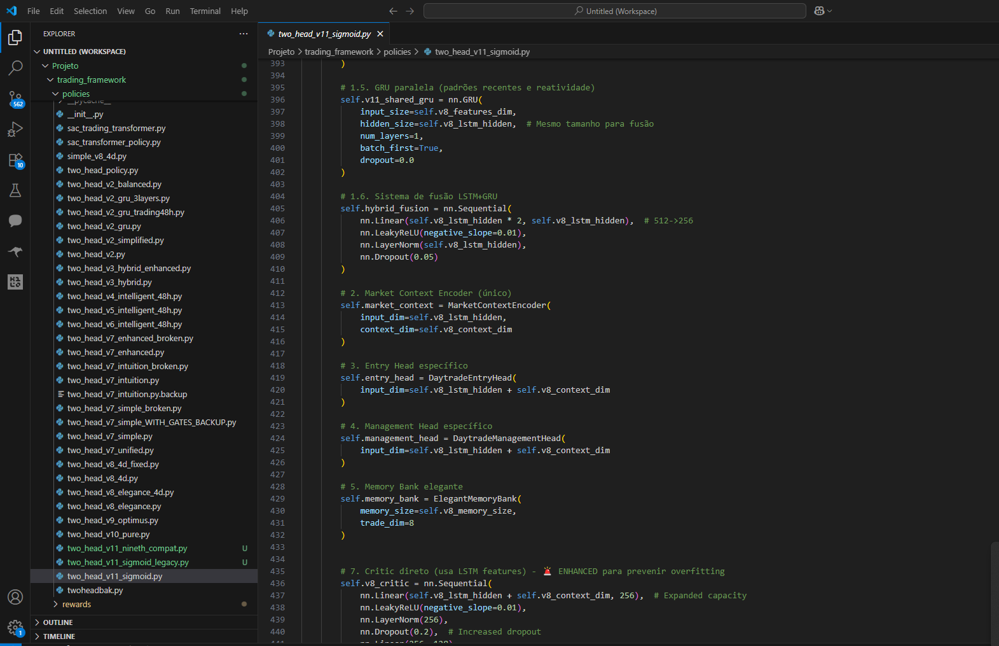

# App Rádio Entre Rios 105.5 FM

**App mobile multiplataforma desenvolvido em Flutter para streaming de rádio ao vivo, notícias e podcasts.**

> App oficial da Rádio Entre Rios 105.5 FM - Palmitos/SC

## 🎯 Características

- **Integração com Backend**: Conectado ao sistema WordPress do site da rádio via API REST
- **Player Interativo**: Player sticky com controles completos e histórico de músicas tocadas
- **Notícias em Tempo Real**: Feed de notícias sincronizado com o site
- **Exibição de Música Atual**: Mostra o nome da música que está tocando no momento
- **Histórico de Reprodução**: Visualize as últimas músicas tocadas
- **Podcasts**: Acesso aos últimos podcasts disponíveis
- **Streaming ao Vivo**: Transmissão da programação 24h
- **Tema Escuro**: Design moderno com fundo escuro para conforto visual
- **Design Responsivo**: Adaptado para diferentes tamanhos de tela

## 🛠️ Tecnologias

- Flutter 3.0+
- Provider (gerenciamento de estado)
- Just Audio (streaming de áudio)
- HTTP/Dio (requisições API)
- Cached Network Image (cache de imagens)

## 📱 Estrutura do App

```
lib/
├── main.dart              # Entrada do app
├── models/               # Modelos de dados
│   ├── news.dart        # Modelo de notícia
│   └── podcast.dart     # Modelo de podcast
├── screens/             # Telas do app
│   └── home_screen.dart # Tela principal
├── services/            # Serviços e APIs
│   ├── api_service.dart    # Cliente HTTP
│   ├── news_service.dart   # Serviço de notícias
│   ├── podcast_service.dart # Serviço de podcasts
│   └── radio_service.dart  # Serviço do player
├── utils/               # Utilidades
│   └── theme.dart       # Tema do app
└── widgets/             # Componentes
    ├── news_card.dart      # Card de notícia
    ├── news_list.dart      # Lista de notícias
    ├── podcast_card.dart   # Card de podcast
    ├── podcast_section.dart # Seção de podcasts
    └── sticky_player.dart  # Player fixo
```

## 🚀 Como Executar

1. Instale o Flutter SDK: https://flutter.dev/docs/get-started/install

2. Clone o projeto:
```bash
cd app-radio
```

3. Instale as dependências:
```bash
flutter pub get
```

4. Execute o app:
```bash
flutter run
```

## 📦 Build para Produção

### Android
```bash
flutter build apk --release
# ou para AAB (Google Play)
flutter build appbundle --release
```

### iOS
```bash
flutter build ios --release
```

## 🎨 Cores da Marca

- **Laranja Principal**: #FF7F27
- **Fundo Escuro**: #0D0D0D
- **Superfície**: #1A1A1A
- **Cards**: #262626
- **Texto Principal**: #FFFFFF
- **Texto Secundário**: #B3B3B3

## 📡 APIs Utilizadas

- **Notícias**: `https://radioentrerios.com.br/wp-content/noticias/get_noticias.php`
- **Podcasts**: `https://radioentrerios.com.br/wp-json/wp/v2/podcasts`
- **Stream**: `https://radioentrerios.com.br/stream`

## 🔧 Configurações Necessárias

### Android
1. Adicione permissões de internet em `android/app/src/main/AndroidManifest.xml`:
```xml
<uses-permission android:name="android.permission.INTERNET"/>
<uses-permission android:name="android.permission.WAKE_LOCK"/>
```

2. Para build de produção, configure as chaves de assinatura:
   - Copie `android/key.properties.example` para `android/key.properties`
   - Preencha com suas credenciais de assinatura
   - Certifique-se de que o arquivo keystore está no local correto

### iOS
- Configure o App Transport Security em `ios/Runner/Info.plist`:
```xml
<key>NSAppTransportSecurity</key>
<dict>
    <key>NSAllowsArbitraryLoads</key>
    <true/>
</dict>
```

## 📝 TODO

- [ ] Implementar player de podcasts completo
- [ ] Adicionar tela de detalhes de notícias
- [ ] Sistema de notificações push
- [ ] Modo offline com cache
- [ ] Tela de configurações
- [ ] Compartilhamento de notícias
- [ ] Timer para desligar rádio
- [ ] Gravação de programas favoritos

## 📸 Screenshots

<div align="center">
  
  
  
</div>

*Tela principal com player sticky | Player interativo com histórico | Feed de notícias*

## 🔒 Segurança

- Arquivos sensíveis (keystores, senhas) estão no `.gitignore`
- Use `key.properties.example` como modelo para configuração
- Nunca commite credenciais reais no repositório

## 📄 Licença

Este é um projeto desenvolvido para fins de portfólio. O código está disponível para referência.

## 👨‍💻 Autor

Desenvolvido para Rádio Entre Rios 105.5 FM - Palmitos/SC