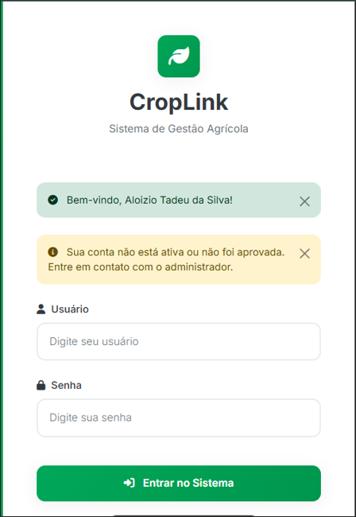

# 🌾 CropLink - Agricultural Management System / Sistema de Gestão Agrícola

[English](#english) | [Português](#português)

---

<a name="english"></a>
## 🇺🇸 English

**Complete agricultural management system developed in Flask for rural producers**

Full-featured ERP system with inventory, machinery, silos, employees, and financial reporting functionalities.



---

### 🚀 Key Features

- **Multi-tenant System**: Complete data isolation per user
- **Inventory Management**: Supply control and movements
- **Machinery Control**: Maintenance and scheduling
- **Silos and Grains**: Storage management
- **Human Resources**: Employees and day laborers
- **Financial Module**: Accounts payable/receivable, cash flow
- **Cache System**: Optimized performance with Redis/SimpleCache
- **Responsive Design**: Mobile-first interface

---

### 🛠️ Technologies

**Backend:**
- **Python 3.11+**
- **Flask** - Web framework
- **SQLAlchemy** - ORM
- **PostgreSQL** - Database (production)
- **SQLite** - Database (development)

**Frontend:**
- **HTML5/CSS3**
- **JavaScript (Vanilla)**
- **Bootstrap** - UI framework
- **Chart.js** - Data visualization

**Infrastructure:**
- **Gunicorn** - WSGI server
- **Redis** - Caching (optional)
- **Docker** - Containerization support

---

### 📂 Project Structure

```
croplink/
├── app/                    # Main application module
│   ├── __init__.py        # Flask app and routes
│   ├── models.py          # SQLAlchemy models
│   ├── services.py        # Business logic
│   ├── auth.py            # Authentication and authorization
│   ├── utils.py           # Utilities and validations
│   └── cache.py           # Cache system
├── config/                # Configurations
│   └── gunicorn.conf.py   # Gunicorn config
├── templates/             # Jinja2 templates
├── static/               # CSS, JS, images
├── run.py                # Entry point
├── requirements.txt      # Python dependencies
└── README.md            # This file
```

---

### 🚀 Quick Start

#### Prerequisites
- Python 3.11 or higher
- PostgreSQL (for production) or SQLite (development)
- Git

#### 1. Clone Repository
```bash
git clone <repository-url>
cd croplink
```

#### 2. Create Virtual Environment
```bash
python -m venv venv
source venv/bin/activate  # Linux/Mac
# or
venv\Scripts\activate  # Windows
```

#### 3. Install Dependencies
```bash
pip install -r requirements.txt
```

#### 4. Configure Environment

**⚠️ IMPORTANT:** See [SECURITY.md](./SECURITY.md) for detailed security instructions.

Copy the example file and configure:
```bash
cp .env.example .env
# Edit .env with your credentials
```

#### 5. Run Application
```bash
# Development
python run.py

# Production (with Gunicorn)
gunicorn --config config/gunicorn.conf.py app:app
```

Access: `http://localhost:5000`

---

### ⚙️ Environment Configuration

**Required Variables:**
- `SECRET_KEY` - Strong secret key
- `DATABASE_URL` - PostgreSQL connection URL
- `ROOT_ADMIN_PASSWORD` - Admin password
- `ALOIZIO_ADMIN_PASSWORD` - Secondary admin password

**Optional Variables:**
- `MAIL_SERVER`, `MAIL_USERNAME`, `MAIL_PASSWORD` - Email configuration
- `REDIS_URL` - Redis cache
- `FLASK_ENV` - Environment (development/production)

See `.env.example` for complete list.

---

### 🔒 Security Features

✅ **Authentication**
- Bcrypt password hashing
- Secure login with Flask-Login
- Session timeout

✅ **Authorization**
- Access level system
- User data isolation (multi-tenant)
- New user approval

✅ **Web Protection**
- CSRF protection (Flask-WTF)
- Configurable CORS
- Secure cookies
- HTTP-only cookies

✅ **Database**
- SQLAlchemy ORM (prevents SQL injection)
- Prepared statements
- Secure connection pool

---

### 📊 Main Modules

#### Inventory
- Agricultural inputs control
- Stock movements
- Application tracking
- Low stock alerts

#### Machinery
- Equipment registration
- Maintenance scheduling
- Operational hours tracking
- Cost control

#### Silos
- Grain storage management
- Input/output tracking
- Quality reports
- Capacity monitoring

#### Financial
- Accounts payable/receivable
- Cash flow
- Supplier/client management
- Financial reports

#### Human Resources
- Employee registration
- Day laborers control
- Time tracking
- Payment receipts

---

### 🌐 Deployment

#### Replit
1. Fork project on Replit
2. Configure Secrets with environment variables
3. Publish with "Autoscale Deployment"

#### Render
1. Connect GitHub repository
2. Build Command: `pip install -r requirements.txt`
3. Start Command: `gunicorn --config config/gunicorn.conf.py app:app`
4. Configure environment variables

#### Heroku
```bash
heroku create your-app-name
heroku config:set SECRET_KEY=your-secret-key
heroku config:set DATABASE_URL=your-postgres-url
git push heroku main
```

---

### 🐛 Troubleshooting

**Connection Error:**
```bash
# Check DATABASE_URL
echo $DATABASE_URL
```

**Template Not Found:**
```bash
# Verify templates folder
ls templates/
```

**Cache Issues:**
```bash
# Test Redis connection
redis-cli ping
```

---

### 📜 License

This project is property of Fazenda Rebelato. All rights reserved.

---

<a name="português"></a>
## 🇧🇷 Português

**Sistema completo de gestão agrícola desenvolvido em Flask para produtores rurais**

Sistema ERP completo com funcionalidades de inventário, maquinário, silos, funcionários e relatórios financeiros.

---

### 🚀 Características Principais

- **Sistema Multi-tenant**: Isolamento completo de dados por usuário
- **Gestão de Inventário**: Controle de insumos e movimentações
- **Controle de Maquinário**: Manutenção e agendamentos
- **Silos e Grãos**: Gerenciamento de armazenamento
- **Recursos Humanos**: Funcionários e diaristas
- **Módulo Financeiro**: Contas a pagar/receber, fluxo de caixa
- **Sistema de Cache**: Performance otimizada com Redis/SimpleCache
- **Design Responsivo**: Interface mobile-first

---

### 🛠️ Tecnologias

**Backend:**
- **Python 3.11+**
- **Flask** - Framework web
- **SQLAlchemy** - ORM
- **PostgreSQL** - Banco de dados (produção)
- **SQLite** - Banco de dados (desenvolvimento)

**Frontend:**
- **HTML5/CSS3**
- **JavaScript (Vanilla)**
- **Bootstrap** - Framework UI
- **Chart.js** - Visualização de dados

**Infraestrutura:**
- **Gunicorn** - Servidor WSGI
- **Redis** - Cache (opcional)
- **Docker** - Suporte a containerização

---

### 📂 Estrutura do Projeto

```
croplink/
├── app/                    # Módulo principal da aplicação
│   ├── __init__.py        # Aplicação Flask e rotas
│   ├── models.py          # Modelos SQLAlchemy
│   ├── services.py        # Lógica de negócio
│   ├── auth.py            # Autenticação e autorização
│   ├── utils.py           # Utilitários e validações
│   └── cache.py           # Sistema de cache
├── config/                # Configurações
│   └── gunicorn.conf.py   # Configuração Gunicorn
├── templates/             # Templates Jinja2
├── static/               # CSS, JS, imagens
├── run.py                # Ponto de entrada
├── requirements.txt      # Dependências Python
└── README.md            # Este arquivo
```

---

### 🚀 Início Rápido

#### Pré-requisitos
- Python 3.11 ou superior
- PostgreSQL (para produção) ou SQLite (desenvolvimento)
- Git

#### 1. Clonar Repositório
```bash
git clone <url-do-repositorio>
cd croplink
```

#### 2. Criar Ambiente Virtual
```bash
python -m venv venv
source venv/bin/activate  # Linux/Mac
# ou
venv\Scripts\activate  # Windows
```

#### 3. Instalar Dependências
```bash
pip install -r requirements.txt
```

#### 4. Configurar Ambiente

**⚠️ IMPORTANTE:** Veja [SECURITY.md](./SECURITY.md) para instruções detalhadas de segurança.

Copie o arquivo de exemplo e configure:
```bash
cp .env.example .env
# Edite .env com suas credenciais
```

#### 5. Executar Aplicação
```bash
# Desenvolvimento
python run.py

# Produção (com Gunicorn)
gunicorn --config config/gunicorn.conf.py app:app
```

Acesse: `http://localhost:5000`

---

### ⚙️ Configuração de Ambiente

**Variáveis Obrigatórias:**
- `SECRET_KEY` - Chave secreta forte
- `DATABASE_URL` - URL de conexão PostgreSQL
- `ROOT_ADMIN_PASSWORD` - Senha do administrador
- `ALOIZIO_ADMIN_PASSWORD` - Senha do admin secundário

**Variáveis Opcionais:**
- `MAIL_SERVER`, `MAIL_USERNAME`, `MAIL_PASSWORD` - Configuração de email
- `REDIS_URL` - Cache Redis
- `FLASK_ENV` - Ambiente (development/production)

Veja `.env.example` para lista completa.

---

### 🔒 Recursos de Segurança

✅ **Autenticação**
- Hash de senhas com Bcrypt
- Login seguro com Flask-Login
- Timeout de sessão

✅ **Autorização**
- Sistema de níveis de acesso
- Isolamento de dados por usuário (multi-tenant)
- Aprovação de novos usuários

✅ **Proteção Web**
- Proteção CSRF (Flask-WTF)
- CORS configurável
- Cookies seguros
- HTTP-only cookies

✅ **Banco de Dados**
- SQLAlchemy ORM (previne SQL injection)
- Prepared statements
- Pool de conexões seguro

---

### 📊 Módulos Principais

#### Inventário
- Controle de insumos agrícolas
- Movimentações de estoque
- Rastreamento de aplicações
- Alertas de estoque baixo

#### Maquinário
- Registro de equipamentos
- Agendamento de manutenção
- Rastreamento de horas operacionais
- Controle de custos

#### Silos
- Gestão de armazenamento de grãos
- Rastreamento de entrada/saída
- Relatórios de qualidade
- Monitoramento de capacidade

#### Financeiro
- Contas a pagar/receber
- Fluxo de caixa
- Gestão de fornecedores/clientes
- Relatórios financeiros

#### Recursos Humanos
- Registro de funcionários
- Controle de diaristas
- Marcação de ponto
- Recibos de pagamento

---

### 🌐 Deploy

#### Replit
1. Fork o projeto no Replit
2. Configure Secrets com variáveis de ambiente
3. Publique com "Autoscale Deployment"

#### Render
1. Conecte repositório GitHub
2. Build Command: `pip install -r requirements.txt`
3. Start Command: `gunicorn --config config/gunicorn.conf.py app:app`
4. Configure variáveis de ambiente

#### Heroku
```bash
heroku create nome-da-sua-app
heroku config:set SECRET_KEY=sua-chave-secreta
heroku config:set DATABASE_URL=sua-url-postgres
git push heroku main
```

---

### 🐛 Troubleshooting

**Erro de Conexão:**
```bash
# Verificar DATABASE_URL
echo $DATABASE_URL
```

**Template Não Encontrado:**
```bash
# Verificar pasta templates
ls templates/
```

**Problemas com Cache:**
```bash
# Testar conexão Redis
redis-cli ping
```

---

### 📜 Licença

Este projeto é propriedade da Fazenda Rebelato. Todos os direitos reservados.

---

**Version / Versão**: 2.0.0
**Last Update / Última Atualização**: November 2025

---

> **Note:** For detailed security instructions, see [SECURITY.md](./SECURITY.md)

> **Nota:** Para instruções detalhadas de segurança, veja [SECURITY.md](./SECURITY.md)
