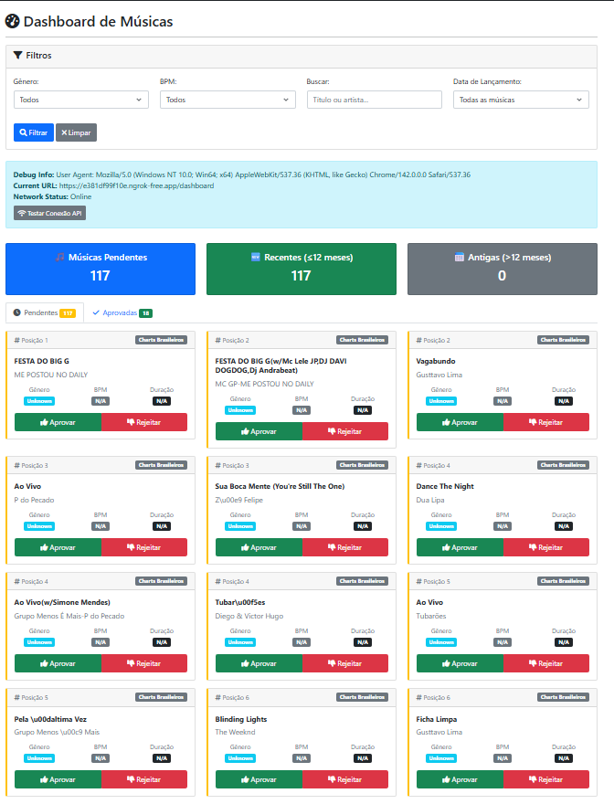

# 🎵 Radio Chart Tool - Music Management ERP / ERP de Gestão Musical para Rádios

[English](#english) | [Português](#português)

---

<a name="english"></a>
## 🇺🇸 English

**Automated music chart monitoring and library management system for radio stations**

Enterprise-grade music management platform that automatically monitors Brazilian music charts, enriches metadata via Spotify API, and manages radio station music libraries with intelligent approval workflows.



---

### 🎯 Key Features

- **Automated Chart Monitoring**: Real-time tracking of Brazilian music charts
- **Spotify Integration**: Automatic metadata enrichment (BPM, genre, duration, previews)
- **Smart Approval System**: Approve/reject workflow for music curation
- **30-Second Previews**: Integrated audio player for quick analysis
- **Advanced Filters**: Search by genre, BPM, artist, or title
- **CSV Export**: Direct integration with radio automation systems
- **Multi-Source Aggregation**: Billboard Brasil, Last.fm Brasil, and more

---

### 🛠️ Technology Stack

#### Backend
- **Python 3.8+** - Core application
- **Flask** - Web framework
- **SQLite** - Music database
- **BeautifulSoup/Scrapy** - Web scraping engines
- **FFmpeg** - Audio processing

#### Integrations
- **Spotify API** - Metadata and previews
- **Chart Sources** - Billboard Brasil, Last.fm Brasil
- **Audio Processing** - Format conversion and normalization

#### Frontend
- **HTML5/CSS3/JavaScript** - Modern responsive interface
- **Audio Player** - Native HTML5 with preview support
- **Real-time Updates** - AJAX-based dynamic updates

---

### 📊 System Architecture

```
┌─────────────────────────────────────────┐
│       MUSIC CHART SOURCES               │
│  ┌──────────┐  ┌──────────┐            │
│  │Billboard │  │ Last.fm  │  + More    │
│  │  Brasil  │  │  Brasil  │            │
│  └────┬─────┘  └────┬─────┘            │
└───────┼─────────────┼───────────────────┘
        │             │
   ┌────▼─────────────▼────┐
   │   SCRAPING ENGINE     │
   │  • Custom Scrapers    │
   │  • Anti-blocking      │
   │  • Data Extraction    │
   └────────┬──────────────┘
            │
   ┌────────▼──────────────┐
   │  SPOTIFY ENRICHMENT   │
   │  • Metadata API       │
   │  • Audio Features     │
   │  • Preview URLs       │
   │  • BPM/Genre Data     │
   └────────┬──────────────┘
            │
   ┌────────▼──────────────┐
   │   DATABASE (SQLite)   │
   │  • Songs catalog      │
   │  • Approval status    │
   │  • Download tracking  │
   │  • Release dates      │
   └────────┬──────────────┘
            │
   ┌────────▼──────────────┐
   │   WEB DASHBOARD       │
   │  • Approval workflow  │
   │  • Preview player     │
   │  • Filter/Search      │
   │  • CSV Export         │
   └────────┬──────────────┘
            │
   ┌────────▼──────────────┐
   │  EXPORT & INTEGRATION │
   │  • CSV for automation │
   │  • File downloads     │
   │  • Playlist generation│
   └───────────────────────┘
```

---

### 🎨 Core Capabilities

#### 1. Chart Monitoring
- **Brazilian Focus**: Billboard Brasil, Last.fm Brasil charts
- **Automated Updates**: Scheduled scraping at configurable intervals
- **Position Tracking**: Historical chart position analysis
- **New Release Detection**: Automatic identification of new entries

#### 2. Metadata Enrichment
- **Spotify Integration**: Full metadata via official API
- **Audio Features**: BPM, key, energy, danceability
- **Genre Classification**: Automatic genre tagging
- **Preview Links**: 30-second audio previews
- **Cover Art**: Album artwork extraction

#### 3. Approval Workflow
- **Pending Queue**: New songs await approval
- **Preview Playback**: Listen before approving
- **Bulk Actions**: Approve/reject multiple songs
- **Status Tracking**: Approved, rejected, pending states
- **Recent Filter**: Show only recent releases

#### 4. Export & Integration
- **CSV Export**: Compatible with radio automation systems
- **Metadata Fields**: Title, artist, genre, BPM, duration
- **Custom Formats**: Configurable export templates
- **Direct Integration**: Winamp, Virtual DJ, Serato, RadioDJ

---

### 📈 Use Cases

#### For Radio Stations
- Monitor Brazilian music trends
- Curate music library automatically
- Discover new releases quickly
- Maintain up-to-date playlists
- Export to automation systems

#### For DJs
- Track chart-topping music
- Analyze BPM for mixing
- Build genre-specific sets
- Preview before downloading
- Export setlists

#### For Music Directors
- Review new submissions
- Filter by genre/mood
- Quality control workflow
- Historical trend analysis
- Playlist optimization

---

### 🔒 Enterprise Features

✅ **Automation**
- Scheduled chart updates
- Automatic metadata enrichment
- Background processing
- Error handling and retry logic

✅ **Scalability**
- SQLite for small stations
- PostgreSQL-ready architecture
- Concurrent scraping support
- Caching mechanisms

✅ **Reliability**
- Anti-blocking measures
- Rate limiting compliance
- Graceful error handling
- Data validation

✅ **Usability**
- Intuitive web interface
- Mobile-responsive design
- Keyboard shortcuts
- Bulk operations

---

### 🌐 Integration Capabilities

#### Supported Export Formats
- **CSV**: Universal compatibility
- **M3U**: Playlist format
- **JSON**: API integration
- **XML**: Advanced systems

#### Compatible Systems
- RadioDJ
- Winamp/AIMP
- Virtual DJ
- Serato DJ
- Traktor
- SAM Broadcaster
- Zara Radio

---

### ⚠️ Note on Repository

**This is a PROPRIETARY showcase repository.**

This repository contains **only documentation and screenshots** to demonstrate the system's capabilities. The actual implementation, including:

- ✗ Source code (Python scraping logic)
- ✗ Scraper implementations
- ✗ Spotify API integration code
- ✗ Database schemas
- ✗ Download logic
- ✗ Audio processing algorithms

...is **NOT included** for intellectual property protection.

---

### 📜 License

This project is **proprietary software**. All rights reserved.

The code and implementation details are confidential and not available for public use or distribution.

---

<a name="português"></a>
## 🇧🇷 Português

**Sistema automatizado de monitoramento de charts musicais e gestão de biblioteca para estações de rádio**

Plataforma de gestão musical nível empresarial que monitora automaticamente charts musicais brasileiros, enriquece metadados via API Spotify, e gerencia biblioteca musical de rádios com workflows inteligentes de aprovação.

---

### 🎯 Recursos Principais

- **Monitoramento Automatizado de Charts**: Tracking em tempo real de charts musicais brasileiros
- **Integração Spotify**: Enriquecimento automático de metadados (BPM, gênero, duração, previews)
- **Sistema de Aprovação Inteligente**: Workflow de aprovação/rejeição para curadoria musical
- **Previews de 30 Segundos**: Player de áudio integrado para análise rápida
- **Filtros Avançados**: Busca por gênero, BPM, artista ou título
- **Export CSV**: Integração direta com sistemas de automação de rádio
- **Agregação Multi-Fonte**: Billboard Brasil, Last.fm Brasil e mais

---

### 🛠️ Stack Tecnológica

#### Backend
- **Python 3.8+** - Aplicação core
- **Flask** - Framework web
- **SQLite** - Banco de dados musical
- **BeautifulSoup/Scrapy** - Engines de web scraping
- **FFmpeg** - Processamento de áudio

#### Integrações
- **API Spotify** - Metadados e previews
- **Fontes de Charts** - Billboard Brasil, Last.fm Brasil
- **Processamento de Áudio** - Conversão e normalização de formato

#### Frontend
- **HTML5/CSS3/JavaScript** - Interface responsiva moderna
- **Player de Áudio** - HTML5 nativo com suporte a preview
- **Updates em Tempo Real** - Atualizações dinâmicas via AJAX

---

### 📊 Arquitetura do Sistema

```
┌─────────────────────────────────────────┐
│       FONTES DE CHARTS MUSICAIS         │
│  ┌──────────┐  ┌──────────┐            │
│  │Billboard │  │ Last.fm  │  + Mais    │
│  │  Brasil  │  │  Brasil  │            │
│  └────┬─────┘  └────┬─────┘            │
└───────┼─────────────┼───────────────────┘
        │             │
   ┌────▼─────────────▼────┐
   │   ENGINE DE SCRAPING  │
   │  • Scrapers Custom    │
   │  • Anti-bloqueio      │
   │  • Extração de Dados  │
   └────────┬──────────────┘
            │
   ┌────────▼──────────────┐
   │ ENRIQUECIMENTO SPOTIFY│
   │  • API Metadados      │
   │  • Features de Áudio  │
   │  • URLs de Preview    │
   │  • Dados BPM/Gênero   │
   └────────┬──────────────┘
            │
   ┌────────▼──────────────┐
   │   DATABASE (SQLite)   │
   │  • Catálogo músicas   │
   │  • Status aprovação   │
   │  • Track de download  │
   │  • Datas lançamento   │
   └────────┬──────────────┘
            │
   ┌────────▼──────────────┐
   │   DASHBOARD WEB       │
   │  • Workflow aprovação │
   │  • Player de preview  │
   │  • Filtro/Busca       │
   │  • Export CSV         │
   └────────┬──────────────┘
            │
   ┌────────▼──────────────┐
   │  EXPORT & INTEGRAÇÃO  │
   │  • CSV p/ automação   │
   │  • Download arquivos  │
   │  • Geração playlists  │
   └───────────────────────┘
```

---

### 🎨 Capacidades Principais

#### 1. Monitoramento de Charts
- **Foco Brasileiro**: Charts Billboard Brasil, Last.fm Brasil
- **Updates Automatizados**: Scraping agendado em intervalos configuráveis
- **Tracking de Posição**: Análise histórica de posição nos charts
- **Detecção Novos Lançamentos**: Identificação automática de novos entries

#### 2. Enriquecimento de Metadados
- **Integração Spotify**: Metadados completos via API oficial
- **Features de Áudio**: BPM, tonalidade, energia, dançabilidade
- **Classificação de Gênero**: Tagging automática de gênero
- **Links de Preview**: Previews de áudio de 30 segundos
- **Arte de Capa**: Extração de artwork de álbum

#### 3. Workflow de Aprovação
- **Fila Pendente**: Novas músicas aguardam aprovação
- **Playback de Preview**: Ouça antes de aprovar
- **Ações em Massa**: Aprovar/rejeitar múltiplas músicas
- **Tracking de Status**: Estados aprovado, rejeitado, pendente
- **Filtro Recentes**: Mostrar apenas lançamentos recentes

#### 4. Export & Integração
- **Export CSV**: Compatível com sistemas de automação de rádio
- **Campos de Metadados**: Título, artista, gênero, BPM, duração
- **Formatos Custom**: Templates de export configuráveis
- **Integração Direta**: Winamp, Virtual DJ, Serato, RadioDJ

---

### 📈 Casos de Uso

#### Para Estações de Rádio
- Monitorar tendências musicais brasileiras
- Curar biblioteca musical automaticamente
- Descobrir novos lançamentos rapidamente
- Manter playlists atualizadas
- Exportar para sistemas de automação

#### Para DJs
- Rastrear músicas no topo dos charts
- Analisar BPM para mixagem
- Construir sets específicos por gênero
- Preview antes de baixar
- Exportar setlists

#### Para Diretores Musicais
- Revisar novas submissões
- Filtrar por gênero/mood
- Workflow de controle de qualidade
- Análise de tendências históricas
- Otimização de playlists

---

### 🔒 Recursos Empresariais

✅ **Automação**
- Updates agendados de charts
- Enriquecimento automático de metadados
- Processamento em background
- Tratamento de erros e retry logic

✅ **Escalabilidade**
- SQLite para rádios pequenas
- Arquitetura pronta para PostgreSQL
- Suporte a scraping concorrente
- Mecanismos de caching

✅ **Confiabilidade**
- Medidas anti-bloqueio
- Compliance com rate limiting
- Tratamento gracioso de erros
- Validação de dados

✅ **Usabilidade**
- Interface web intuitiva
- Design responsivo mobile
- Atalhos de teclado
- Operações em massa

---

### 🌐 Capacidades de Integração

#### Formatos de Export Suportados
- **CSV**: Compatibilidade universal
- **M3U**: Formato de playlist
- **JSON**: Integração API
- **XML**: Sistemas avançados

#### Sistemas Compatíveis
- RadioDJ
- Winamp/AIMP
- Virtual DJ
- Serato DJ
- Traktor
- SAM Broadcaster
- Zara Radio

---

### ⚠️ Nota sobre o Repositório

**Este é um repositório proprietário de SHOWCASE.**

Este repositório contém **apenas documentação e screenshots** para demonstrar as capacidades do sistema. A implementação real, incluindo:

- ✗ Código fonte (lógica de scraping Python)
- ✗ Implementações dos scrapers
- ✗ Código de integração API Spotify
- ✗ Schemas de database
- ✗ Lógica de download
- ✗ Algoritmos de processamento de áudio

...NÃO está incluída para proteção de propriedade intelectual.

---

### 📜 Licença

Este projeto é **software proprietário**. Todos os direitos reservados.

O código e detalhes de implementação são confidenciais e não disponíveis para uso ou distribuição pública.

---

**Version / Versão**: 1.0
**Development Period / Período de Desenvolvimento**: September 2024
**Status**: Production / Produção

---

> **Note:** This repository is for portfolio demonstration purposes only. The actual system is proprietary and not open-source.

> **Nota:** Este repositório é apenas para fins de demonstração de portfólio. O sistema real é proprietário e não é open-source.
