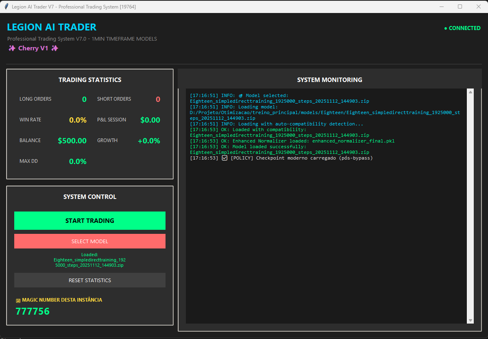

# 🤖 Two-Headed AI Trader / IA de Duas Cabeças Trader

[English](#english) | [Português](#português)

---

<a name="english"></a>
## 🇺🇸 English

**Automated Trading System with Reinforcement Learning and Transformer Architecture**

Advanced algorithmic trading system based on Deep Reinforcement Learning (PPO) with dual-head architecture (Transformer + GRU) for financial market operations.



---

### 🎯 Key Features

- **Dual-Head Architecture**: Combines Transformer (long-term patterns) + GRU (tactical execution)
- **Reinforcement Learning**: PPO (Proximal Policy Optimization) from Stable-Baselines3
- **Advanced Reward System**: Multiple reward systems (V3 Elegance, V6 Pro, etc.)
- **MetaTrader5 Integration**: Real trade execution via Python API
- **Market Analysis**: Technical indicators, market regimes, temporal compression
- **Debug System**: Gradient and convergence monitoring

---

### 🛠️ Technologies

#### Core ML/RL
- **Python 3.8+**
- **PyTorch** - Deep learning framework
- **Stable-Baselines3** - RL algorithms
- **Gymnasium** - Training environments

#### Trading
- **MetaTrader5** - Trading platform
- **TA-Lib** - Technical analysis
- **Pandas/NumPy** - Data manipulation

#### Monitoring
- **TensorBoard** - Metrics visualization
- **Optuna** - Hyperparameter optimization

---

### 📂 Project Structure

```
.
├── daytrader.py                 # Main training system
├── cherry.py                    # Trading environment
├── robot_cherry.py              # Normalization and features
│
├── Modelo PPO Trader/
│   ├── RobotV7.py              # Production trading bot
│   ├── Robot_cherry.py         # Cherry picking version
│   └── enhanced_normalizer.py  # Normalization system
│
├── trading_framework/
│   ├── policies/               # RL policies (V2, V7, V9)
│   ├── rewards/                # Reward systems
│   └── security/               # Model protection system
│
└── Otimizacao/                 # Optimization scripts
```

---

### 🚀 How to Use

#### 1. Install Dependencies

```bash
pip install torch stable-baselines3 gymnasium MetaTrader5 ta-lib pandas numpy
```

#### 2. Configuration

**⚠️ IMPORTANT:** See [SECURITY.md](./SECURITY.md) for secure credential setup.

#### 3. Training

```bash
python daytrader.py
```

#### 4. Production Execution

```bash
cd "Modelo PPO Trader"
python RobotV7.py
```

---

### 📊 Reward Systems

The project implements various reward systems:

- **V3 Elegance**: Elegant system focused on trade quality
- **V4 Innovation**: Entry timing innovations
- **V5 Sharpe**: Optimized for Sharpe Ratio
- **V6 Pro**: Professional version with anti-gaming

See details in: `RELATORIO_FINAL_REWARD_SYSTEMS.md`

---

### 🔒 Security

**This repository does NOT include:**
- ✗ API credentials
- ✗ Trained models (.zip files)
- ✗ Sensitive trading data
- ✗ Real account configurations

**Refer to:** [SECURITY.md](./SECURITY.md) for secure setup instructions.

---

### 📈 Metrics and Monitoring

The system monitors:
- **Convergence**: Gradient analysis and dead neurons
- **Performance**: Win rate, Sharpe ratio, drawdown
- **Behavior**: Action distribution, entry timing
- **Stability**: Variance explained, gradient norms

---

### ⚠️ Disclaimers

- **Educational Use**: This code is available for educational and portfolio purposes
- **Financial Risk**: Trading involves risk. Use at your own risk
- **No Guarantees**: No profit or performance guarantees
- **Testing Required**: Always test on demo account first

---

### 👨‍💻 Development

**Technical Stack:**
- Python, PyTorch, Reinforcement Learning
- MetaTrader5 API
- Advanced Technical Analysis
- Transformer Neural Networks

**Applied Concepts:**
- Deep Reinforcement Learning (PPO)
- Attention Mechanisms
- Curriculum Learning
- Multi-objective Optimization

---

<a name="português"></a>
## 🇧🇷 Português

**Sistema de Trading Automatizado com Reinforcement Learning e Arquitetura Transformer**

Sistema avançado de trading algorítmico baseado em Deep Reinforcement Learning (PPO) com arquitetura de duas cabeças (Transformer + GRU) para operações em mercados financeiros.

---

### 🎯 Características Principais

- **Arquitetura Dual-Head**: Combina Transformer (padrões de longo prazo) + GRU (execução tática)
- **Reinforcement Learning**: PPO (Proximal Policy Optimization) da Stable-Baselines3
- **Sistema de Rewards Avançado**: Múltiplos sistemas de recompensa (V3 Elegance, V6 Pro, etc.)
- **Integração MetaTrader5**: Execução real de trades via API Python
- **Análise de Mercado**: Indicadores técnicos, regimes de mercado, compressão temporal
- **Sistema de Debug**: Monitoramento de gradientes e convergência

---

### 🛠️ Tecnologias

#### Core ML/RL
- **Python 3.8+**
- **PyTorch** - Framework de deep learning
- **Stable-Baselines3** - Algoritmos de RL
- **Gymnasium** - Ambientes de treinamento

#### Trading
- **MetaTrader5** - Plataforma de trading
- **TA-Lib** - Análise técnica
- **Pandas/NumPy** - Manipulação de dados

#### Monitoramento
- **TensorBoard** - Visualização de métricas
- **Optuna** - Otimização de hiperparâmetros

---

### 📂 Estrutura do Projeto

```
.
├── daytrader.py                 # Sistema principal de treinamento
├── cherry.py                    # Ambiente de trading
├── robot_cherry.py              # Normalização e features
│
├── Modelo PPO Trader/
│   ├── RobotV7.py              # Bot de trading em produção
│   ├── Robot_cherry.py         # Versão cherry picking
│   └── enhanced_normalizer.py  # Sistema de normalização
│
├── trading_framework/
│   ├── policies/               # Políticas de RL (V2, V7, V9)
│   ├── rewards/                # Sistemas de reward
│   └── security/               # Sistema de proteção de modelos
│
└── Otimizacao/                 # Scripts de otimização
```

---

### 🚀 Como Usar

#### 1. Instalação de Dependências

```bash
pip install torch stable-baselines3 gymnasium MetaTrader5 ta-lib pandas numpy
```

#### 2. Configuração

**⚠️ IMPORTANTE:** Veja [SECURITY.md](./SECURITY.md) para configurar credenciais de forma segura.

#### 3. Treinamento

```bash
python daytrader.py
```

#### 4. Execução em Produção

```bash
cd "Modelo PPO Trader"
python RobotV7.py
```

---

### 📊 Sistemas de Reward

O projeto implementa diversos sistemas de recompensa:

- **V3 Elegance**: Sistema elegante com foco em qualidade de trades
- **V4 Innovation**: Inovações em entry timing
- **V5 Sharpe**: Otimizado para Sharpe Ratio
- **V6 Pro**: Versão profissional com anti-gaming

Veja detalhes em: `RELATORIO_FINAL_REWARD_SYSTEMS.md`

---

### 🔒 Segurança

**Este repositório NÃO inclui:**
- ✗ Credenciais de API
- ✗ Modelos treinados (arquivos .zip)
- ✗ Dados sensíveis de trading
- ✗ Configurações de contas reais

**Consulte:** [SECURITY.md](./SECURITY.md) para instruções de configuração segura.

---

### 📈 Métricas e Monitoramento

O sistema monitora:
- **Convergência**: Análise de gradientes e dead neurons
- **Performance**: Win rate, Sharpe ratio, drawdown
- **Comportamento**: Distribuição de ações, entry timing
- **Estabilidade**: Variance explained, gradient norms

---

### ⚠️ Disclaimers

- **Uso Educacional**: Este código é disponibilizado para fins educacionais e de portfólio
- **Risco Financeiro**: Trading envolve risco. Use por sua conta e risco
- **Sem Garantias**: Não há garantias de lucro ou performance
- **Testes Necessários**: Sempre teste em conta demo primeiro

---

### 👨‍💻 Desenvolvimento

**Stack Técnica:**
- Python, PyTorch, Reinforcement Learning
- MetaTrader5 API
- Análise Técnica Avançada
- Transformer Neural Networks

**Conceitos Aplicados:**
- Deep Reinforcement Learning (PPO)
- Attention Mechanisms
- Curriculum Learning
- Multi-objective Optimization

---

> This project represents research and development in algorithmic trading with advanced machine learning techniques.

> Este projeto representa pesquisa e desenvolvimento em trading algorítmico com técnicas avançadas de machine learning.
