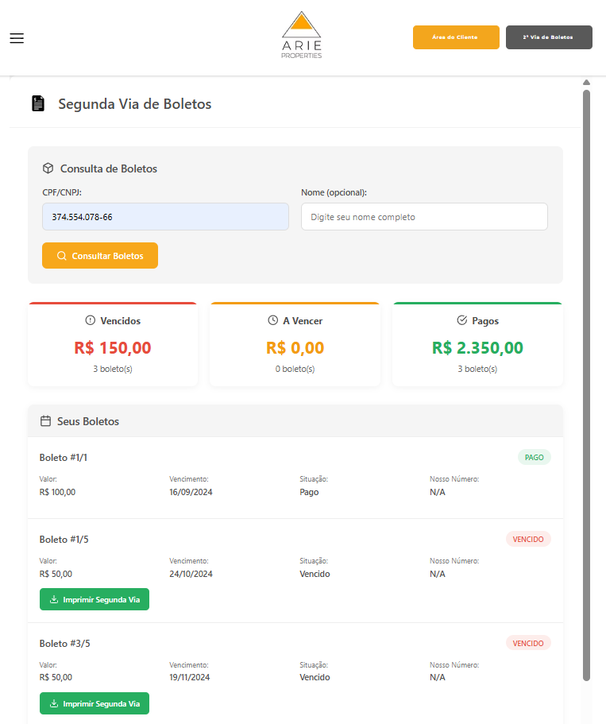

# 🏢 ARIE Properties - Wix Integration Widget / Widget de Integração Wix

[English](#english) | [Português](#português)

---

<a name="english"></a>
## 🇺🇸 English

**Custom Wix widget for financial consultation and payment slip management integrated with Sienge ERP**

Advanced integration system between Wix platform and Sienge ERP API, allowing customers to consult invoices, generate duplicate payment slips, and manage their financial data directly from the website.



---

### 🎯 Key Features

- **Financial Consultation**: Check invoices and pending payments by CPF/CNPJ
- **Duplicate Payment Slips**: Generate second copy of payment slips automatically
- **Sienge Integration**: Direct connection with Sienge ERP via REST API
- **CORS Proxy**: Backend solution to bypass cross-origin restrictions
- **Real-time Validation**: Instant CPF/CNPJ validation and data verification
- **Responsive Interface**: Mobile-first design for all devices

---

### 🛠️ Technologies

#### Frontend
- **HTML5/CSS3** - Modern interface
- **JavaScript (Vanilla)** - Interactive logic
- **Wix Platform** - Hosting and deployment
- **Wix Velo** - Backend serverless functions

#### Backend
- **Node.js** - CORS proxy server
- **Wix HTTP Functions** - Serverless endpoints
- **Express.js** - CORS proxy middleware

#### Integration
- **Sienge API** - ERP system integration
- **REST API** - HTTP communication
- **Basic Auth** - API authentication

---

### 📂 Project Structure

```
Widget ARIE PROPERTIES WIX/
├── backend-proxy.js.example     # Wix backend functions template
├── config.js.example            # Configuration template
├── http-functions.js            # HTTP endpoints (protected)
├── widget-debug-completo.html   # Debug version with logging
├── widget-wix-simples.html      # Simple production version
├── consulta-notas.html          # Invoice consultation page
├── cors-proxy/                  # Node.js CORS proxy server
│   ├── server.js               # Express server (protected)
│   └── package.json            # Dependencies
├── wix-api/                     # Wix-specific implementations
│   └── widget-simples/         # Simple widget version
└── screenshots/                 # Interface screenshots
```

---

### 🚀 Setup Guide

#### Prerequisites
- Wix Premium account with Velo (Developer Mode)
- Sienge ERP API access
- Node.js 14+ (for CORS proxy)

#### 1. Configure Wix Backend

**Enable Velo Developer Mode:**
1. Access your Wix site editor
2. Enable "Dev Mode" in the top menu
3. Navigate to "Backend" section

**Create HTTP Functions:**

Copy `backend-proxy.js.example` to `backend-proxy.js` and configure:

```javascript
const API_CONFIG = {
    baseURL: 'https://api.sienge.com.br/YOUR_COMPANY/public/api/v1',
    auth: {
        username: 'YOUR_USERNAME',
        password: 'YOUR_PASSWORD'
    }
};
```

**Upload to Wix:**
- Place file in: `Backend > HTTP Functions > backend-proxy.js`
- Wix will automatically deploy serverless endpoints

#### 2. Frontend Widget Setup

**Add HTML Component:**
1. In Wix editor, add "HTML iframe" component
2. Copy content from `widget-wix-simples.html`
3. Paste into the HTML iframe settings

**Configure Widget:**
- Update API endpoints to match your Wix site URL
- Test in preview mode before publishing

#### 3. CORS Proxy (Optional)

For local development or additional CORS handling:

```bash
cd cors-proxy
npm install
node server.js
```

Server will run on `http://localhost:3000`

---

### 🔒 Security Features

✅ **API Protection**
- Basic Authentication for Sienge API
- Credentials stored in backend (not exposed to frontend)
- Environment variables support

✅ **Data Validation**
- CPF/CNPJ format validation
- Input sanitization
- Error handling with user-friendly messages

✅ **CORS Security**
- Controlled cross-origin access
- Backend proxy to hide API credentials
- Secure header configuration

---

### 📊 Main Functions

#### Financial Consultation (`get_boletos`)
- Search invoices by CPF/CNPJ
- Filter customer-specific data
- Return structured payment information

#### Duplicate Payment Slip (`post_segundaVia`)
- Generate second copy of payment slips
- Retrieve PDF download URL
- Return digitable line for manual payment

#### Invoice Details (`get_boletosDetalhes`)
- Fetch detailed invoice information
- Show due, overdue, and paid installments
- Provide download options

---

### 🌐 Deployment

#### Wix Production

1. **Publish Backend:**
   - Ensure `backend-proxy.js` is in Backend folder
   - Wix auto-deploys on save

2. **Publish Frontend:**
   - Embed widget in desired page
   - Publish site changes

3. **Test Endpoints:**
   - Verify API calls work in production
   - Check console for errors

#### CORS Proxy Hosting

For Node.js proxy, deploy to:
- **Heroku**: `git push heroku main`
- **Render**: Connect GitHub repo
- **Vercel**: Deploy serverless functions

---

### ⚠️ Important Notes

- **Security**: Never commit real credentials to Git
- **API Limits**: Sienge API may have rate limits
- **Testing**: Always test with demo data first
- **Wix Limitations**: Wix backend has execution time limits (~50s)
- **CORS**: Some endpoints require backend proxy

---

### 📜 License

This project was developed for ARIE Properties. All rights reserved.

---

<a name="português"></a>
## 🇧🇷 Português

**Widget customizado para Wix de consulta financeira e gestão de boletos integrado com ERP Sienge**

Sistema avançado de integração entre plataforma Wix e API do ERP Sienge, permitindo que clientes consultem faturas, gerem segunda via de boletos e gerenciem seus dados financeiros diretamente pelo site.

---

### 🎯 Características Principais

- **Consulta Financeira**: Verificar faturas e pagamentos pendentes por CPF/CNPJ
- **Segunda Via de Boletos**: Gerar segunda via de boletos automaticamente
- **Integração Sienge**: Conexão direta com ERP Sienge via API REST
- **Proxy CORS**: Solução backend para contornar restrições de origem cruzada
- **Validação em Tempo Real**: Validação instantânea de CPF/CNPJ e dados
- **Interface Responsiva**: Design mobile-first para todos os dispositivos

---

### 🛠️ Tecnologias

#### Frontend
- **HTML5/CSS3** - Interface moderna
- **JavaScript (Vanilla)** - Lógica interativa
- **Plataforma Wix** - Hospedagem e deployment
- **Wix Velo** - Funções backend serverless

#### Backend
- **Node.js** - Servidor proxy CORS
- **Wix HTTP Functions** - Endpoints serverless
- **Express.js** - Middleware proxy CORS

#### Integração
- **API Sienge** - Integração com sistema ERP
- **REST API** - Comunicação HTTP
- **Basic Auth** - Autenticação API

---

### 📂 Estrutura do Projeto

```
Widget ARIE PROPERTIES WIX/
├── backend-proxy.js.example     # Template funções backend Wix
├── config.js.example            # Template de configuração
├── http-functions.js            # Endpoints HTTP (protegido)
├── widget-debug-completo.html   # Versão debug com logging
├── widget-wix-simples.html      # Versão simples produção
├── consulta-notas.html          # Página consulta de notas
├── cors-proxy/                  # Servidor proxy CORS Node.js
│   ├── server.js               # Servidor Express (protegido)
│   └── package.json            # Dependências
├── wix-api/                     # Implementações específicas Wix
│   └── widget-simples/         # Versão simples do widget
└── screenshots/                 # Screenshots da interface
```

---

### 🚀 Guia de Configuração

#### Pré-requisitos
- Conta Premium Wix com Velo (Modo Desenvolvedor)
- Acesso à API do Sienge ERP
- Node.js 14+ (para proxy CORS)

#### 1. Configurar Backend Wix

**Habilitar Modo Desenvolvedor Velo:**
1. Acesse editor do seu site Wix
2. Ative "Dev Mode" no menu superior
3. Navegue para seção "Backend"

**Criar HTTP Functions:**

Copie `backend-proxy.js.example` para `backend-proxy.js` e configure:

```javascript
const API_CONFIG = {
    baseURL: 'https://api.sienge.com.br/SUA_EMPRESA/public/api/v1',
    auth: {
        username: 'SEU_USUARIO',
        password: 'SUA_SENHA'
    }
};
```

**Upload para Wix:**
- Coloque arquivo em: `Backend > HTTP Functions > backend-proxy.js`
- Wix fará deploy automático dos endpoints serverless

#### 2. Configuração Widget Frontend

**Adicionar Componente HTML:**
1. No editor Wix, adicione componente "HTML iframe"
2. Copie conteúdo de `widget-wix-simples.html`
3. Cole nas configurações do HTML iframe

**Configurar Widget:**
- Atualize endpoints API para URL do seu site Wix
- Teste em modo preview antes de publicar

#### 3. Proxy CORS (Opcional)

Para desenvolvimento local ou tratamento adicional de CORS:

```bash
cd cors-proxy
npm install
node server.js
```

Servidor rodará em `http://localhost:3000`

---

### 🔒 Recursos de Segurança

✅ **Proteção de API**
- Basic Authentication para API Sienge
- Credenciais armazenadas no backend (não expostas ao frontend)
- Suporte a variáveis de ambiente

✅ **Validação de Dados**
- Validação de formato CPF/CNPJ
- Sanitização de inputs
- Tratamento de erros com mensagens amigáveis

✅ **Segurança CORS**
- Acesso cross-origin controlado
- Proxy backend para ocultar credenciais API
- Configuração segura de headers

---

### 📊 Funções Principais

#### Consulta Financeira (`get_boletos`)
- Buscar faturas por CPF/CNPJ
- Filtrar dados específicos do cliente
- Retornar informações estruturadas de pagamento

#### Segunda Via de Boleto (`post_segundaVia`)
- Gerar segunda via de boletos
- Recuperar URL de download do PDF
- Retornar linha digitável para pagamento manual

#### Detalhes da Fatura (`get_boletosDetalhes`)
- Buscar informações detalhadas da fatura
- Mostrar parcelas a vencer, vencidas e pagas
- Fornecer opções de download

---

### 🌐 Deploy

#### Produção Wix

1. **Publicar Backend:**
   - Certifique-se que `backend-proxy.js` está na pasta Backend
   - Wix faz deploy automático ao salvar

2. **Publicar Frontend:**
   - Incorpore widget na página desejada
   - Publique alterações do site

3. **Testar Endpoints:**
   - Verifique se chamadas API funcionam em produção
   - Cheque console para erros

#### Hospedagem Proxy CORS

Para proxy Node.js, faça deploy em:
- **Heroku**: `git push heroku main`
- **Render**: Conecte repositório GitHub
- **Vercel**: Deploy funções serverless

---

### ⚠️ Notas Importantes

- **Segurança**: Nunca commite credenciais reais no Git
- **Limites API**: API Sienge pode ter limites de taxa
- **Testes**: Sempre teste com dados demo primeiro
- **Limitações Wix**: Backend Wix tem limites de tempo de execução (~50s)
- **CORS**: Alguns endpoints requerem proxy backend

---

### 📜 Licença

Este projeto foi desenvolvido para ARIE Properties. Todos os direitos reservados.

---

**Version / Versão**: 1.0.0
**Last Update / Última Atualização**: July 2024

---

> **Note:** For detailed security instructions, see [SECURITY.md](./SECURITY.md)

> **Nota:** Para instruções detalhadas de segurança, veja [SECURITY.md](./SECURITY.md)
